# Design Document — chat-pagination

## Overview

This feature adds virtual pagination with upward lazy loading to the real-time chat. Instead of rendering the entire `messages[]` array on every update, a **Pagination_Manager** module maintains a sliding **Virtual_Window** — a contiguous slice `[windowStart, windowEnd)` of the Full_History — and only reflects that slice in the DOM.

Key behaviors:
- On hydration, only the last `INITIAL_BATCH` (60) messages are rendered.
- Scrolling near the top loads the previous `PAGE_SIZE` (40) messages and inserts them at the top without a full re-render, preserving the user's visual position (Anchor_Scroll).
- New real-time messages are always appended to the DOM tail and to the Full_History; Sticky_Bottom auto-scroll and the "↓ Nuevo mensaje" indicator respect the user's current scroll position.
- Session_Dividers are windowed alongside messages and never duplicated.
- JSON_Download reads directly from `localStorage` and is completely unaffected.

---

## Architecture

### Component Diagram

```mermaid
flowchart TD
    subgraph Browser
        LS[(localStorage\ndwjc2_chat_history)]
        subgraph chat.js
            FH[Full_History\n messages&#91;&#93;]
            PM[Pagination_Manager]
            VW[Virtual_Window\n windowStart / windowEnd]
            DOM[Chat_Box DOM]
            SB[Sticky_Bottom\n shouldStickToBottom]
            NMI[New-Message Indicator\n ↓ Nuevo mensaje]
            LMI[Load-More Indicator\n spinner / button]
        end
        WS[WebSocket\n server messages]
    end

    LS -->|loadHistory| FH
    FH -->|initVirtualWindow| PM
    PM -->|manages| VW
    VW -->|renderWindow| DOM
    WS -->|appendMessage| PM
    PM --> SB
    PM --> NMI
    PM --> LMI
    DOM -->|scroll events| PM
```



### Data Flow — Initial Load

```
DOMContentLoaded
  → hydrateHistory()
      → loadHistory()           # reads localStorage → messages[]
      → PM.initVirtualWindow()  # sets windowStart = max(0, len-INITIAL_BATCH)
                                #         windowEnd   = len
      → PM.renderWindow()       # builds DOM for [windowStart, windowEnd)
      → updateLoadIndicator()   # show/hide top spinner
      → scrollChatToBottom()    # force bottom
```

### Data Flow — Lazy Loading (scroll up)

```
scroll event on .chat-scroll-area
  → isChatNearTop()             # scrollTop ≤ LOAD_MORE_TRIGGER (150px)
  → PM.loadPreviousPage()
      → isLoading = true
      → anchor = firstVisibleElement + its scrollTop offset
      → newStart = max(0, windowStart - PAGE_SIZE)
      → build fragment for messages[newStart … windowStart) + dividers in range
      → chatBox.prepend(fragment)
      → Anchor_Scroll: restore visual position
      → windowStart = newStart
      → updateLoadIndicator()
      → isLoading = false
```

### Data Flow — Real-Time Message

```
WebSocket 'chat' event
  → addMessage(text, author, { remote: true })
      → messages.push(msg)      # Full_History grows
      → saveHistory()           # persists to localStorage
      → PM.appendMessage(msg)   # appends single DOM node
      → windowEnd++
      → if shouldStickToBottom  → scrollChatToBottom()
        else if author ≠ self   → showNewMessageIndicator()
```

---

## Components and Interfaces

### Pagination_Manager (new module inside chat.js)

All state and functions live inside the existing `DOMContentLoaded` closure to share access to `chatBox`, `messages`, `activeDividers`, `player`, etc.

```js
// ── Pagination state ────────────────────────────────────────
const INITIAL_BATCH = 60;   // messages rendered on first load
const PAGE_SIZE     = 40;   // messages loaded per lazy-load step
const LOAD_MORE_TRIGGER = 150; // px from top that triggers load

let windowStart = 0;   // index into messages[] of first rendered msg
let windowEnd   = 0;   // index into messages[] of last rendered msg + 1
let isLoading   = false; // prevents concurrent loadPreviousPage calls
```

#### `PM.initVirtualWindow()`
**Signature:** `function initVirtualWindow(): void`

Sets up the initial window after `loadHistory()` populates `messages[]`.
- `windowStart = Math.max(0, messages.length - INITIAL_BATCH)`
- `windowEnd   = messages.length`
- Calls `renderWindow()` to build the DOM.
- Calls `updateLoadIndicator()`.
- Calls `scrollChatToBottom({ smooth: false, force: true })`.

#### `PM.renderWindow()`
**Signature:** `function renderWindow(): void`

Full re-render of the current window slice. Only called on initialization or after a reset — **never** during lazy loading or real-time message arrival.
- Clears `chatBox.innerHTML`.
- Iterates `messages[windowStart … windowEnd)`.
- For each message, calls `buildMessageNode(msg)`.
- Inserts dividers from `getDividersForRange(windowStart, windowEnd)` at the correct positions.
- Prepends the load-more indicator element.

#### `PM.loadPreviousPage()`
**Signature:** `function loadPreviousPage(): void`

Loads the previous batch of messages without a full re-render.
1. Guard: if `isLoading || windowStart === 0` → return immediately.
2. `isLoading = true`.
3. Record the anchor: `anchorEl = chatBox.firstElementChild` (skip load indicator), `anchorOffsetBefore = anchorEl.getBoundingClientRect().top`.
4. Compute `newStart = Math.max(0, windowStart - PAGE_SIZE)`.
5. Build a `DocumentFragment` for `messages[newStart … windowStart)` with their dividers via `buildBatchFragment(newStart, windowStart)`.
6. Insert the fragment after the load-more indicator: `loadIndicator.after(fragment)` (or `chatBox.prepend(fragment)` if indicator is separate).
7. **Anchor_Scroll**: `anchorOffsetAfter = anchorEl.getBoundingClientRect().top`; `chatScrollArea.scrollTop += anchorOffsetAfter - anchorOffsetBefore`.
8. `windowStart = newStart`.
9. `updateLoadIndicator()`.
10. `isLoading = false`.

#### `PM.appendMessage(msg)`
**Signature:** `function appendMessage(msg: MessageObject): void`

Appends a single message node to the DOM tail. Called for both WebSocket messages and locally sent messages (replaces the `renderMessages()` call in `addMessage()`).
- `buildMessageNode(msg)` → node.
- `chatBox.appendChild(node)`.
- Insert any dividers at `afterIndex === windowEnd` (from `activeDividers`).
- `windowEnd++`.
- `refreshStickToBottomState()`.
- If `shouldStickToBottom`: `scrollChatToBottom({ smooth: true, force: true })`.
- Else if `msg.author !== player.name`: `showNewMessageIndicator()`.

#### `PM.buildMessageNode(msg)`
**Signature:** `function buildMessageNode(msg: MessageObject): HTMLElement`

Pure DOM builder — extracts the message node creation logic from `renderMessages()`. Returns the `.chat-message` wrapper div with avatar, bubble, meta line, and text. Identical output to the per-message loop in the current `renderMessages()`.

#### `PM.buildBatchFragment(startIdx, endIdx)`
**Signature:** `function buildBatchFragment(start: number, end: number): DocumentFragment`

Creates a `DocumentFragment` containing message nodes and correctly interleaved divider elements for `messages[start … end)`.
- Calls `getDividersForRange(start, end)` to collect applicable dividers.
- Uses `buildMessageNode()` for each message.
- Injects `buildDividerNode(text)` immediately after the message at position `i` when a divider has `afterIndex === i + 1` (within the range).

#### `PM.getDividersForRange(start, end)`
**Signature:** `function getDividersForRange(start: number, end: number): DividerObject[]`

Returns the subset of `activeDividers` where `afterIndex` is within `[start, end]`. Filters and returns a new array; does not mutate `activeDividers`.

#### `PM.buildDividerNode(text)`
**Signature:** `function buildDividerNode(text: string): HTMLElement`

Returns a `<div class="system-divider">` element with `textContent = text`.

#### `PM.updateLoadIndicator()`
**Signature:** `function updateLoadIndicator(): void`

Shows or hides the top load-more indicator based on `windowStart`:
- If `windowStart > 0`: show indicator, remove `loading` state (spinner → "Cargar mensajes anteriores").
- If `windowStart === 0`: hide indicator completely.
- During `isLoading === true`: add `loading` class (show spinner).

#### `PM.showNewMessageIndicator()`
**Signature:** `function showNewMessageIndicator(): void`

Makes the "↓ Nuevo mensaje" banner visible. Idempotent — safe to call multiple times.

#### `PM.hideNewMessageIndicator()`
**Signature:** `function hideNewMessageIndicator(): void`

Hides the "↓ Nuevo mensaje" banner.

---

### Modified Existing Functions

#### `hydrateHistory()` — modified
```js
function hydrateHistory() {
  if (historyHydrated) return;
  loadHistory();
  historyHydrated = true;
  // CHANGED: replace renderMessages() call with PM initialization
  initVirtualWindow();
}
```

#### `addMessage(text, author, options)` — modified
The current `renderMessages()` + `scrollChatToBottom()` calls at the end are replaced:
```js
// BEFORE:
renderMessages();
scrollChatToBottom({ smooth: true, force: forceScroll });

// AFTER:
appendMessage(messages[messages.length - 1]);
// scrollChatToBottom is handled inside appendMessage()
```

#### `renderMessages()` — role limited
`renderMessages()` is retained but its usage is restricted:
- Called by `renderPlayers()` handler on `player_list` WS events and `avatar_update` events (these require a full re-render to update avatars across all visible messages). **Note:** after pagination is live, these full re-renders should also respect `windowStart`/`windowEnd` — `renderWindow()` replaces `renderMessages()` there too.
- Called on `resetChatHistory()` to wipe the DOM.
- **Never** called from `addMessage()` or `loadPreviousPage()`.

#### `renderSystemDivider(text)` — modified
```js
function renderSystemDivider(text) {
  activeDividers.push({ text, afterIndex: messages.length });
  // CHANGED: append directly to DOM instead of relying on renderMessages
  // Only append if afterIndex is within the current Virtual_Window
  if (messages.length >= windowStart && messages.length <= windowEnd) {
    const el = buildDividerNode(text);
    const wasAtBottom = isChatNearBottom();
    chatBox.appendChild(el);
    if (wasAtBottom) scrollChatToBottom({ smooth: true, force: true });
  }
}
```

---

## Data Models

### Virtual Window State

```js
// Pagination_Manager state variables (added to chat.js closure)
let windowStart = 0;      // Inclusive index into messages[] of first rendered msg
let windowEnd   = 0;      // Exclusive index into messages[] (= windowStart + rendered count)
let isLoading   = false;  // Mutex to prevent concurrent loadPreviousPage calls

const INITIAL_BATCH     = 60;   // Initial messages to render
const PAGE_SIZE         = 40;   // Messages per lazy-load page
const LOAD_MORE_TRIGGER = 150;  // px scrollTop threshold to trigger load
```

### Message Object (unchanged)

```js
{
  id:     number,   // monotonically increasing
  author: string,
  text:   string,
  time:   string,   // "HH:MM"
  role:   'user' | 'assistant' | 'narrator',
  edited: boolean
}
```

### Divider Object (unchanged)

```js
{
  text:       string,  // display text
  afterIndex: number   // insert after messages[afterIndex - 1]; 0 = before all messages
}
```

### Load Indicator Element (new)

```html
<!-- Prepended to #chat-box by initVirtualWindow() -->
<div id="load-more-indicator" class="load-more-indicator" aria-live="polite">
  <span class="load-more-spinner" aria-hidden="true"></span>
  <span class="load-more-text">Cargar mensajes anteriores</span>
</div>
```

CSS states controlled by JS class:
- Default (no class): shows text "Cargar mensajes anteriores"
- `.loading`: hides text, shows animated spinner
- `.hidden` (or `display:none`): element not visible (windowStart === 0)

### New Message Indicator Element (new)

```html
<!-- Appended to .chat-scroll-area (outside #chat-box) -->
<div id="new-message-indicator" class="new-message-indicator hidden" role="button" tabindex="0" aria-label="Saltar al último mensaje">
  ↓ Nuevo mensaje
</div>
```

---

## Correctness Properties

*A property is a characteristic or behavior that should hold true across all valid executions of a system — essentially, a formal statement about what the system should do. Properties serve as the bridge between human-readable specifications and machine-verifiable correctness guarantees.*

### Property 1: Virtual_Window is a suffix slice of Full_History bounded by Initial_Batch

*For any* Full_History of length N, after `initVirtualWindow()`, the Virtual_Window contains exactly `min(N, INITIAL_BATCH)` messages, and those messages are the last `min(N, INITIAL_BATCH)` elements of Full_History in their original order.

**Validates: Requirements 1.1, 1.2**

### Property 2: Full_History completeness — monotone and equal to persisted state

*For any* sequence of `appendMessage()` and `loadPreviousPage()` calls, the length of `messages[]` shall be monotonically non-decreasing, and `messages[]` shall always equal the array obtained by `JSON.parse(localStorage.getItem(HISTORY_KEY))`.

**Validates: Requirements 1.3, 5.1, 5.2, 5.3**

### Property 3: Anchor_Scroll invariant — visual position preserved after top-insertion

*For any* Virtual_Window with `windowStart > 0`, after a call to `loadPreviousPage()`, the element that was the first visible child of `chatBox` before the call shall remain at the same vertical position relative to the viewport (scrollTop delta equals the height of the prepended content).

**Validates: Requirements 2.2**

### Property 4: Sticky_Bottom correctness and new-message indicator

*For any* incoming message `m` and any scroll state:
- IF `shouldStickToBottom === true` at the time `appendMessage(m)` is called, THEN after the call `chatScrollArea.scrollTop` shall equal `chatScrollArea.scrollHeight - chatScrollArea.clientHeight` (scroll is at bottom).
- IF `shouldStickToBottom === false` AND `m.author !== player.name`, THEN after the call the `#new-message-indicator` element SHALL be visible.
- IF `shouldStickToBottom === false` AND `m.author === player.name`, THEN `#new-message-indicator` SHALL NOT become visible.

**Validates: Requirements 3.2, 3.3, 3.4**

### Property 5: No-duplicate dividers with correct range inclusion

*For any* `activeDividers` array and any contiguous range `[start, end)`, calling `getDividersForRange(start, end)` returns exactly the subset of dividers where `afterIndex ∈ [start, end]`, with no duplicates. After any number of `loadPreviousPage()` calls, every divider in `activeDividers` whose `afterIndex` falls within `[windowStart, windowEnd]` appears exactly once in the DOM.

**Validates: Requirements 4.1, 4.2, 4.3**

### Property 6: JSON_Download independence from Virtual_Window

*For any* Virtual_Window state (including `windowStart > 0`, meaning only a subset of Full_History is rendered), the output of the JSON_Download function shall equal `JSON.stringify(JSON.parse(localStorage.getItem('dwjc2_chat_history')))` — that is, the complete Full_History, not the Virtual_Window subset.

**Validates: Requirements 5.1, 5.2, 5.3**

### Property 7: Load indicator reflects Virtual_Window position

*For any* `windowStart` value:
- IF `windowStart > 0` THEN `#load-more-indicator` SHALL be present in the DOM and visible.
- IF `windowStart === 0` THEN `#load-more-indicator` SHALL be hidden (not visible to the user).
- WHILE `isLoading === true` THEN `#load-more-indicator` SHALL show the spinner state.

**Validates: Requirements 7.1, 7.2, 7.3**

### Property 8: loadPreviousPage idempotence under concurrent calls (isLoading flag)

*For any* Virtual_Window with `windowStart > 0`, calling `loadPreviousPage()` N times in rapid succession (before any call completes) SHALL result in exactly one additional batch being inserted into the DOM — equivalent to calling it exactly once. The `isLoading` flag acts as a mutex that makes repeated concurrent invocations no-ops.

**Validates: Requirements 2.5**

---

## Error Handling

### localStorage unavailable or corrupt
- `loadHistory()` already wraps reads in try/catch and falls back to `messages = []`.
- `saveHistory()` already wraps writes in try/catch.
- If `messages` is empty after load, `initVirtualWindow()` sets `windowStart = windowEnd = 0`, renders nothing, hides the load indicator, and sticks to bottom.

### Empty Full_History
- `initVirtualWindow()` with `messages.length === 0` → `windowStart = windowEnd = 0`, `renderWindow()` renders nothing, `updateLoadIndicator()` hides the indicator.

### loadPreviousPage called at windowStart === 0
- Guard check at the top of `loadPreviousPage()` returns immediately. No DOM mutation.

### Divider afterIndex out of range
- `getDividersForRange()` filters strictly; out-of-range dividers are silently skipped for the current render pass. They will appear when the corresponding range is loaded.

### WebSocket disconnect during lazy load
- `isLoading` is always reset in a `finally` block to prevent the mutex from becoming permanently locked if an error occurs mid-insertion.

```js
async function loadPreviousPage() {
  if (isLoading || windowStart === 0) return;
  isLoading = true;
  updateLoadIndicator();
  try {
    // ... insertion logic ...
  } finally {
    isLoading = false;
    updateLoadIndicator();
  }
}
```

### Anchor_Scroll fallback
- If `getBoundingClientRect()` returns zero (element detached), fall back to `chatScrollArea.scrollTop += estimatedHeight` using `PAGE_SIZE * AVG_MSG_HEIGHT_PX` (constant ~60px) as the estimate.

---

## Testing Strategy

### Dual Testing Approach

Both unit/example tests and property-based tests are used together:
- **Unit tests**: verify specific scenarios, edge conditions, and integration points.
- **Property tests**: verify universal invariants across randomly generated inputs.

### Property-Based Testing Library

Use **[fast-check](https://github.com/dubzzz/fast-check)** (JavaScript). It generates random inputs across 100+ iterations per property.

Each property test references its design property via a comment tag:
```
// Feature: chat-pagination, Property N: <property text summary>
```

### Property Tests

Each of the 8 correctness properties maps to one property-based test:

| Property | Test description | Arbitraries |
|---|---|---|
| P1 | Virtual_Window size bounded by INITIAL_BATCH | `fc.array(msgArb, {minLength:0, maxLength:200})` |
| P2 | Full_History monotone and equals localStorage | `fc.array(msgArb)` + sequence of operations |
| P3 | Anchor_Scroll: scrollTop delta = inserted height | `fc.array(msgArb, {minLength:1})` + `fc.integer` windowStart |
| P4 | Sticky_Bottom + new-message indicator | `fc.boolean()` (shouldStickToBottom) + `msgArb` |
| P5 | No-duplicate dividers, correct range | `fc.array(dividerArb)` + `fc.integer` range |
| P6 | JSON_Download independence | `fc.array(msgArb)` with partial Virtual_Window |
| P7 | Load indicator reflects windowStart | `fc.integer({min:0})` windowStart |
| P8 | isLoading mutex (idempotence) | concurrent calls simulated via promise resolution order |

Minimum 100 iterations per test (`fc.configureGlobal({ numRuns: 100 })`).

### Unit Tests (Example-Based)

1. **Initial hydration with history > INITIAL_BATCH**: confirm DOM count = 60.
2. **Initial hydration with history ≤ INITIAL_BATCH**: confirm DOM count = history length.
3. **loadPreviousPage at windowStart = 0**: confirm no DOM change, no flag set.
4. **loadPreviousPage with PAGE_SIZE available**: confirm 40 nodes prepended and scroll anchored.
5. **appendMessage while at bottom**: confirm auto-scroll, no indicator shown.
6. **appendMessage while scrolled up (own message)**: confirm no indicator shown.
7. **appendMessage while scrolled up (other's message)**: confirm indicator shown.
8. **Click new-message indicator**: confirm scroll to bottom and indicator hidden.
9. **renderSystemDivider inside Virtual_Window range**: divider appended immediately.
10. **renderSystemDivider outside Virtual_Window range**: divider stored in activeDividers but NOT appended to DOM.
11. **JSON_Download with partial Virtual_Window**: confirm downloaded JSON matches full localStorage.
12. **resetChatHistory**: confirm windowStart = windowEnd = 0, DOM empty, indicator hidden.

### Integration Test

- Full page load in a real browser (or jsdom) with a 200-message localStorage fixture:
  - Verify DOM has 60 nodes after load.
  - Simulate scroll to top → verify 40 more nodes added, visual position stable.
  - Simulate 4 more scroll-to-top events until windowStart = 0 → verify indicator hidden.
  - Simulate WebSocket message → verify appended to DOM and scrolled to bottom.

---

## HTML Changes Required (chat.html)

### 1. New-Message Indicator

Add inside `.chat-scroll-area`, after `#typing-indicator`:

```html
<section class="chat-scroll-area">
  <div id="chat-box" class="chat-box"></div>
  <div id="typing-indicator" ...></div>

  <!-- NEW: new-message indicator -->
  <div id="new-message-indicator"
       class="new-message-indicator hidden"
       role="button"
       tabindex="0"
       aria-label="Saltar al último mensaje">
    ↓ Nuevo mensaje
  </div>
</section>
```

The `#load-more-indicator` is **not** added in HTML — it is created and prepended by `initVirtualWindow()` in JavaScript to keep it as the first child of `#chat-box`.

### 2. CSS additions (style-chat.css)

```css
/* Load-more indicator at top of chat-box */
.load-more-indicator {
  display: flex;
  align-items: center;
  justify-content: center;
  gap: 0.5rem;
  padding: 0.75rem 1rem;
  color: var(--text-muted, #888);
  font-size: 0.85rem;
  cursor: pointer;
  user-select: none;
  transition: opacity 0.2s;
}
.load-more-indicator.hidden { display: none; }
.load-more-indicator.loading .load-more-text { display: none; }
.load-more-indicator.loading .load-more-spinner { display: inline-block; }
.load-more-spinner {
  display: none;
  width: 16px; height: 16px;
  border: 2px solid currentColor;
  border-top-color: transparent;
  border-radius: 50%;
  animation: spin 0.6s linear infinite;
}
@keyframes spin { to { transform: rotate(360deg); } }

/* New-message indicator at bottom of scroll area */
.new-message-indicator {
  position: sticky;
  bottom: 0.75rem;
  align-self: center;
  background: var(--accent, #2dd4bf);
  color: #fff;
  padding: 0.35rem 1rem;
  border-radius: 999px;
  font-size: 0.85rem;
  cursor: pointer;
  box-shadow: 0 2px 8px rgba(0,0,0,0.3);
  transition: opacity 0.2s, transform 0.2s;
  z-index: 10;
}
.new-message-indicator.hidden {
  opacity: 0;
  pointer-events: none;
  transform: translateY(8px);
}
```

No structural changes are needed beyond the two elements above.
